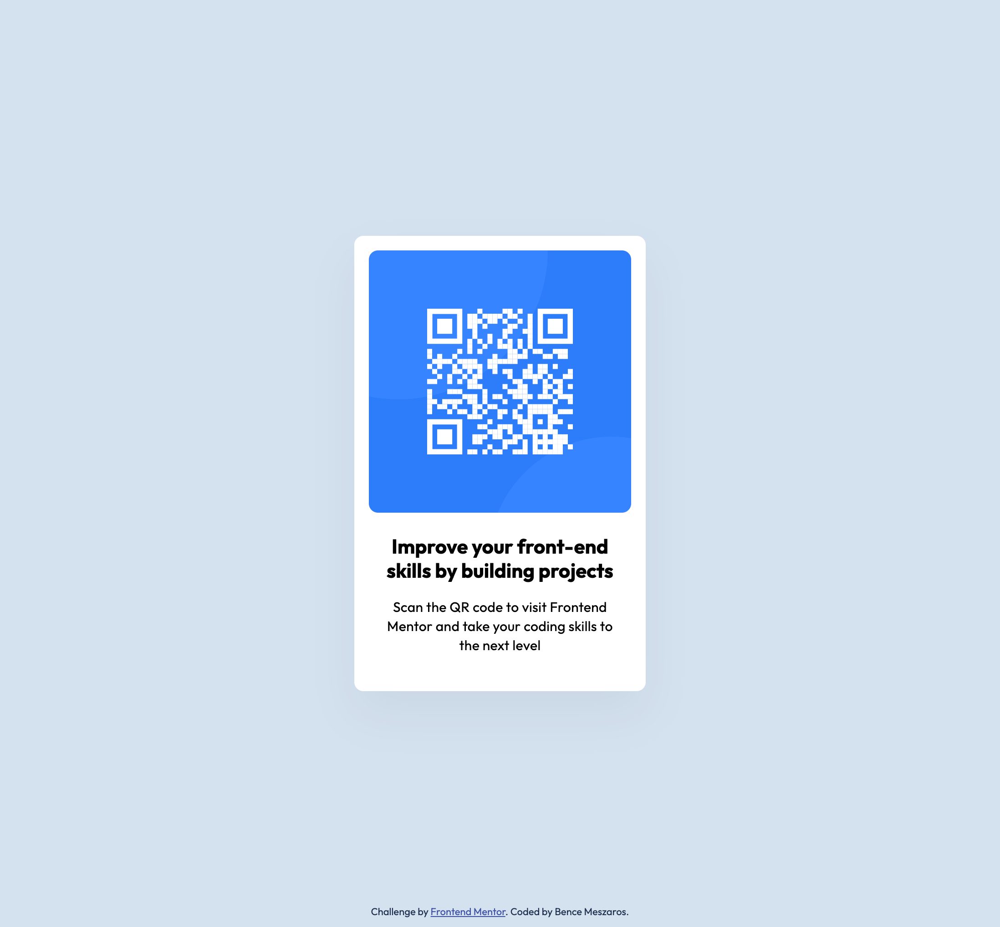

# Frontend Mentor - QR code component solution

This is a solution to the [QR code component challenge on Frontend Mentor](https://www.frontendmentor.io/challenges/qr-code-component-iux_sIO_H). Frontend Mentor challenges help you improve your coding skills by building realistic projects.

## Table of contents

- [Overview](#overview)
  - [Screenshot](#screenshot)
  - [Links](#links)
- [My process](#my-process)
  - [Built with](#built-with)
  - [What I learned](#what-i-learned)
  - [Continued development](#continued-development)
- [Author](#author)

## Overview

### Screenshot



### Links

- Live Site URL: [Link to the website](https://benmesz.github.io/qr-code-component/)

## My process

### Built with

- Semantic HTML5 markup
- CSS custom properties
- Flexbox

### What I learned

Working with CSS variables was a new experience for me and taught me a more structured way to organise a CSS file.

```css
...
  /* Colors */
  --slate-900: #1f314f;
  --slate-500: #68778d;
  --slate-300: #d5e1ef;
  --white: #ffffff;
  --shadow: rgba(0, 0, 0, 0.047);

  /* Spacing */
  --space-xl: 40px;
  --space-l: 24px;
  --space-m: 16px;

  /* Font family */
  --font-outfit: "Outfit", sans-serif;

  /* Font sizes */
  --text-m: 22px;
  --text-s: 15px;
  ...
```

### Continued development

I’d like to continue practicing CSS — specifically working with variables, Flexbox, and Grid layouts.
I'm also aiming to become more comfortable with the Git/GitHub workflow.
Additionally, I want to build more user interfaces using React and JSX to strengthen my front-end skills.

## Author

- Frontend Mentor - [@benmesz](https://www.frontendmentor.io/profile/benmesz)
